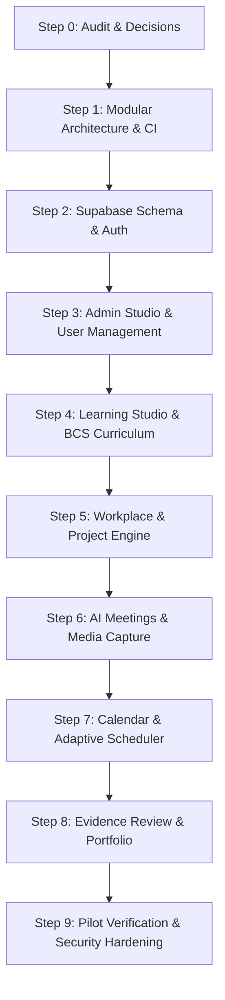

# Advantcore Academy Production Build Plan

## 1. Executive Summary

Advantcore Academy is an AI-guided career-learning and virtual-workplace platform. Its flagship pathway integrates structured knowledge mastery (preparing for the BCS Foundation Certificate in Business Analysis) with supervised, practical experience on simulated Advantcore projects.

This document defines the master engineering and architecture roadmap to transition the verified foundation prototype into an enterprise-grade, secure, persistent, and verifiable production platform.

---

## 2. Strategic Objectives & Core Constraints

### 2.1 Non-Negotiable Constraints
- **Application Identity**: Preserve the name `Advantcore Academy` across all branding, metadata, and interfaces.
- **Dedicated Route & Canonical Domain**: Maintain the `/academy` base path exclusively at `https://app.advantcore.co/academy`. All `*.vercel.app` requests permanently 308-redirect to `https://app.advantcore.co/academy`.
- **Language & Tone**: Professional British English across all learner-facing and administrative content.
- **Truth in Simulation**: Simulated project experience must never be represented as real-world employment.
- **Assessment Integrity**: AI provides assistive feedback and coaching, but human administrator and reviewer sign-off remains the sole authority for pathway publication, evidence approval, and completion certification.
- **Privacy & Non-Discoverability**: Strict anti-indexing (`noindex, nofollow, noai`) and zero public discovery across search engines and AI scrapers.

### 2.2 Cost & Service Tier Policy
- **Strict Free-Tier First**: All infrastructure, database, authentication, and AI integrations operate within genuinely free tiers.
- **No Uncontrolled Billing**: No services with automatic conversion to paid plans or un-budgeted resource scaling.
- **Resilient Fallback**: Every cloud AI dependency must degrade gracefully to server-side deterministic rule engines without disrupting user workflows.

### 2.3 Launch Strategy
- **Invite-Only Pilot**: The initial launch will be a restricted, invitation-only pilot with controlled cohorts before general release.

---

## 3. Account Model & Role Hierarchy

The platform implements a clean separation between **Platform Account Types** and **Pathway/Project Staff Roles**:

```text
┌──────────────────────────────────────────────────────────────┐
│                    PLATFORM ACCOUNT TYPES                    │
├──────────────────────────────┬───────────────────────────────┤
│            ADMIN             │            LEARNER            │
│  - Invites & onboards users  │  - Enrolled in pathways       │
│  - Approves & activates accts│  - Completes lessons & quizzes│
│  - Assigns pathways/projects │  - Participates in simulations│
│  - Manages learning content  │  - Submits portfolio evidence │
│  - Configures AI characters  │  - Changes temp pw on 1st login│
│  - Suspends/archives accounts│  - NO independent registration │
└──────────────────────────────┴───────────────────────────────┘
                               │
                               ▼
┌──────────────────────────────────────────────────────────────┐
│             PATHWAY & PROJECT-SPECIFIC STAFF ROLES           │
├──────────────────────────────────────────────────────────────┤
│  1. Project Sponsor (e.g. Sarah Mitchell)                    │
│     - Defines business objectives, charter & high-level scope│
│  2. BA Supervisor (e.g. Marcus Cole)                         │
│     - Coaches, challenges assumptions & validates evidence   │
│  3. Operational Stakeholder (e.g. Priya Shah)                │
│     - Provides domain context, pain points & process details │
│  4. Independent Reviewer (e.g. Helen Grant)                  │
│     - Conducts independent stage-gate quality assessments    │
│                                                              │
│  * Scope: Strictly bounded to assigned pathway/project.       │
│  * Implementation: Configured as context-aware AI characters │
│    with full extensibility to assign human staff later.      │
└──────────────────────────────────────────────────────────────┘
```

---

## 4. Phased Implementation Roadmap



### Step 0: Repository Audit & Decision Register (Current)
- Establish baseline inventory of codebase, prototypes, and security boundaries.
- Formalise Architecture Decision Records (ADRs).
- Produce service register, status report, and comprehensive feature matrix.

### Step 1: Engineering Baseline, Modular Architecture & CI
- Protect current behaviour with smoke tests and unit test harness (Vitest + Testing Library).
- Modularise the monolithic `components/academy-app.tsx` into domain-specific modules:
  - `components/academy-shell/`
  - `components/dashboard/`
  - `components/learning/`
  - `components/workplace/`
  - `components/meetings/`
  - `components/planner/`
  - `components/admin/`
- Add Zod validation for server environment variables and API contracts.
- Add GitHub Actions CI workflow (typecheck, lint, build, test).

### Step 2: Supabase Development Environment, Schema & Data Isolation
- Connect Supabase project (PostgreSQL + Auth + Storage).
- Build versioned SQL migrations (`supabase/migrations/`).
- Implement Row Level Security (RLS) policies for Admin vs Learner data.
- Enforce mandatory password change for learners on initial sign-in.

### Step 3: Admin Studio & User Management
- Implement secure Admin invitation workflow (generate invite, set temporary credentials).
- Admin dashboard for user lifecycle (pending, active, suspended).
- Pathway and project assignment engine.
- AI character configuration editor (prompts, knowledge boundaries, escalation rules).

### Step 4: Learning Studio & BCS Curriculum
- Model BCS Foundation Certificate curriculum (modules, lessons, outcomes).
- Adaptive quiz engine with attempt history, mastery scoring (90% threshold), and rationales.
- Knowledge readiness calculation with source traceability.

### Step 5: Virtual Workplace & Project Simulation
- Multi-stage project engine (Initiate, Discover, Analyse, Design, Validate).
- Task management with dependencies and stage gates.
- Context-grounded AI characters using role-specific instructions and project facts.

### Step 6: AI Meeting Room & Media Processing
- Interactive meeting simulation with audio synthesis (Web Speech API) and screen share.
- Client-side recording with explicit user consent and privacy indicators.
- Server-side transcript storage, AI meeting minutes generator, and follow-up action extractor.

### Step 7: Calendar & Adaptive Planning Engine
- Adaptive scheduler recalculating dependent activities when deadlines shift.
- User confirmation workflow before applying schedule realignments.
- Google Calendar event link generation and future sync foundation.

### Step 8: Evidence Locker & Reviewer Gate
- Evidence upload and document storage in private Supabase buckets.
- Supervisory review workflow and independent reviewer sign-off gates.
- Portfolio compilation and export.

### Step 9: Pilot Verification & Security Hardening
- End-to-end user flow testing across Admin and Learner roles.
- Penetration testing, rate limit stress testing, and vulnerability scan.
- Launch readiness review for invite-only pilot.

---

## 5. Quality, Testing & Verification Strategy

1. **Automated Verification**:
   - `npm run typecheck` (TypeScript strict zero-error policy).
   - `npm run lint` (ESLint 9+ with Next.js standards).
   - `npm run build` (Turbopack production compilation).
   - Unit & Component tests (`vitest run`).
   - E2E smoke tests (`playwright test`).

2. **Security Gates**:
   - Zero committed secrets or API keys.
   - Strict Row Level Security on every table.
   - All AI calls confined to server-side `/api/academy-ai` or Server Actions.
   - All user inputs sanitized against prompt injection and malicious payloads.
